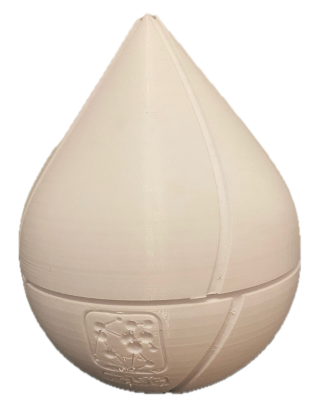
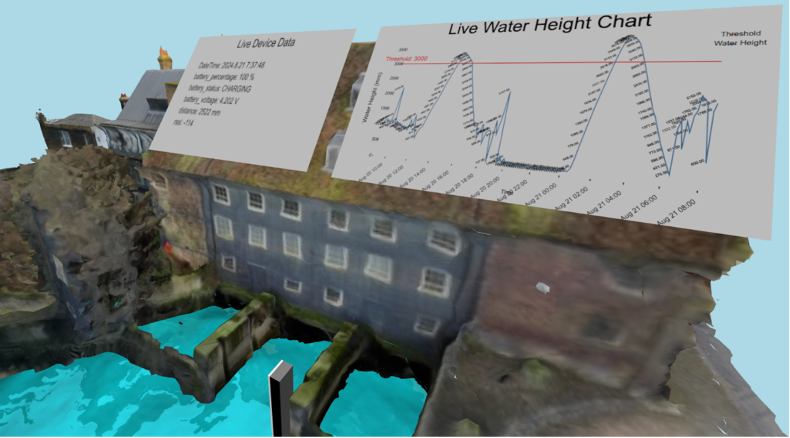

<h1 align="center">Water Scout: A LoRaWAN-Based Water Height Monitoring and Visualization System for Urban Waterways</h1>


A dissertation for an [MSc Connected Environments](https://www.ucl.ac.uk/prospective-students/graduate/taught-degrees/connected-environments-msc)
<p>Centre for Advanced Spatial Analysis, Bartlett Faculty of the Built Environment</p>
<p>University College London </p>

##

This project utilised an Arduino 1310 with LoRaWAN communication and Ultrasonic sensor to monitor the water level of the River Lea that flows below the House Mill. The data observed then transmitted to The Things Network and published to MQTT Client. A 3D visualisation web page using WebXR was built to display the water level of The House Mill in 3D scene. The House Mill was created by [Dr. Gai Jorayev ](https://www.ucl.ac.uk/archaeology/people/gai-jorayev) and published on [Sketchfab](https://sketchfab.com/3d-models/house-mill-in-2019-c87dd07ab29f474aa491c88bc6b4956f). [The 3D visualisations web page](https://casa-0022-water-scout.vercel.app/) was hosted in the cloud for accessibility

|                         Water Scout                           |                3D Visualisations                 |
| :----------------------------------------------------------: | :-------------------------------------------: |
|  |  |


## Repository Content Summary

1. **3D Parts**

   This folder includes the 3D printed parts, namely Fusion360 project files and STLs for the enclosures and the 3D objects for the Data Table.

   - [Water Scout Enclosure](</3D Parts/Enclosure>)
   - [Solar Panel](</3D Parts/Solar Panel/>)


2. **Arduino**

   Includes code during calibration mode, and Water Scout device

   - [DYP-A01](/Arduino/DYP-A01)


3. **Schematics**

   The final schematics including PCB Gerber file used for this project. 
   
4. **Docs**

   This folder holds the page for the Water Scout web pages, including device introduction, 3D Visualisation page and VR mode for Connected Environment exhibition

5. **Dashboard**

   The configuration file for Node Red, Influxdb and Grafana 

6. **Supporting Documents**

   The extra files from the dissertation report, including Lab Testing, Deployment Test, and analysis


## Project Overview

<p align="center">Final prototype</p>

<p align="center">

</p>

## Building

### Used components and tools

Hardware:

* [Arduino MKR WAN 1310](https://docs.arduino.cc/hardware/mkr-wan-1310): microcontroller with LoRa connectivity.
* [DYP-A01](https://www.dypcn.com/high-performance-ultrasonic-precision-rangefinder-dyp-a01-product/): a weatherproof humidity and temperature sensor.
* [Adafruit Solar Charger](https://www.adafruit.com/product/4755): a solar charger module
* [Adafruit Lipo Battery Gauge](https://www.adafruit.com/product/5580)
* [Solar panel](https://coolcomponents.co.uk/products/solar-panel-1-watt): 1 Watt, 10x80 cm.
* 2000 mA 3.7v battery

Software:

 - [InfluxDB](https://www.influxdata.com/)
 - [Telegraf](https://www.influxdata.com/time-series-platform/telegraf/)
 - [Grafana](https://grafana.com/)
 - [Docker Compose](https://docs.docker.com/compose/)

All the software applications are packed into one using Docker


## Results

#### The 3D Visualisations

<p align="center">3D Visualisations scene</p>

<p align="center">

</p>

Click here for [3D Visualisations](https://casa-0022-water-scout.vercel.app/visualisation.html)


#### VR Mode for exhibition

<p align="center">3D Visualisations scene</p>

<p align="center">

</p>


Click here for [VR Mode](https://casa-0022-water-scout.vercel.app/arjs.html)


## Credits

This project was built with inspiration and support from several open-source projects and contributions.

Special thanks to [CASA CE](https://github.com/ucl-casa-ce) team especially for the [Artes](https://github.com/ucl-casa-ce/artes) repository which was instrumental in creating the VR mode for the Water Scout project. Portions of the code for the VR mode were adapted and modified from his project.

Additionally, thanks to the open-source communities and contributors behind the following software and tools, which were essential in the development of this project:

- Arduino
- The Things Network
- InfluxDB
- Grafana
- Docker


## License


###### The software side is licensed under MIT License

```
MIT License

Permission is hereby granted, free of charge, to any person obtaining a copy
of this software and associated documentation files (the "Software"), to deal
in the Software without restriction, including without limitation the rights
to use, copy, modify, merge, publish, distribute, sublicense, and/or sell
copies of the Software, and to permit persons to whom the Software is
furnished to do so, subject to the following conditions:

The above copyright notice and this permission notice shall be included in all
copies or substantial portions of the Software.

THE SOFTWARE IS PROVIDED "AS IS", WITHOUT WARRANTY OF ANY KIND, EXPRESS OR
IMPLIED, INCLUDING BUT NOT LIMITED TO THE WARRANTIES OF MERCHANTABILITY,
FITNESS FOR A PARTICULAR PURPOSE AND NONINFRINGEMENT. IN NO EVENT SHALL THE
AUTHORS OR COPYRIGHT HOLDERS BE LIABLE FOR ANY CLAIM, DAMAGES OR OTHER
LIABILITY, WHETHER IN AN ACTION OF CONTRACT, TORT OR OTHERWISE, ARISING FROM,
OUT OF OR IN CONNECTION WITH THE SOFTWARE OR THE USE OR OTHER DEALINGS IN THE
SOFTWARE.
```

###### The hardware side is licensed under CERN License

```
This documentation describes Open Hardware and is licensed under the CERN OHL v. 1.2.

You may redistribute and modify this documentation under the terms of the CERN OHL v.1.2. (http://ohwr.org/cernohl). This documentation is distributed WITHOUT ANY EXPRESS OR IMPLIED WARRANTY, INCLUDING OF MERCHANTABILITY, SATISFACTORY QUALITY AND FITNESS FOR A PARTICULAR PURPOSE. Please see the CERN OHL v.1.2 for applicable conditions
```
